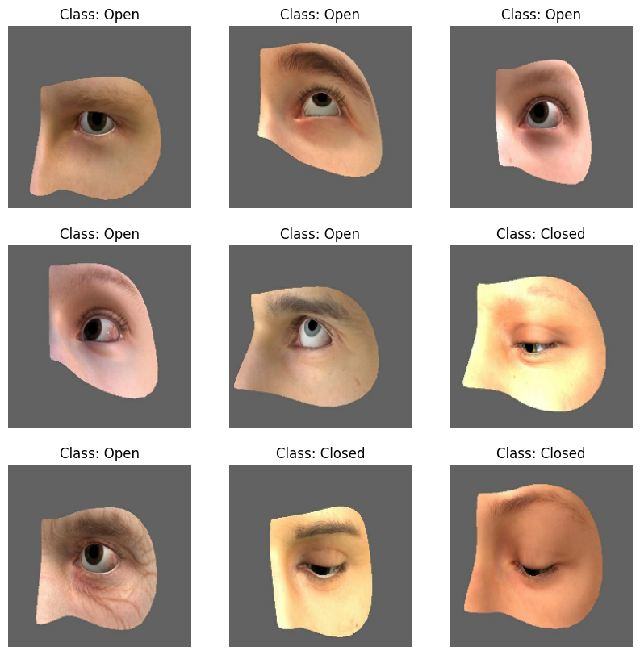
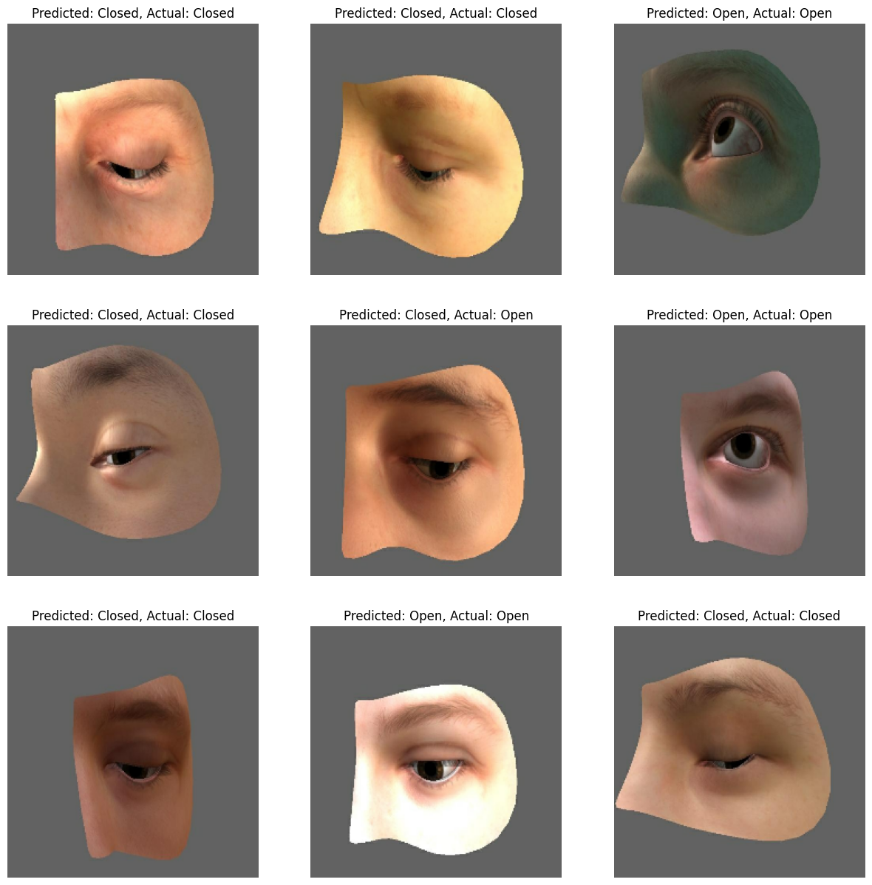

# Drowsiness_Detection - Image Classification

## Overview
This GitHub repository provides code implementations for a Drowsiness Detection Image Classification task, focusing on predicting whether eyes are open or closed. 

## Usage
You can explore the codebase to understand the implementation details for each model. The repository provides clear dataset preparation, model training, and evaluation instructions.

## Getting Started

```bash
# Clone the repository
git clone https://github.com/your-username/drowsiness-detection.git
cd face-mask-detection

# Install the required dependencies
pip install -r requirements.txt
```

## Dataset
The dataset utilized in this project comprises a collection of labeled eye images, indicating whether the eyes are open or closed. It is ideal for training and evaluating drowsiness detection models, as it includes diverse eye movement recordings captured under controlled driving scenarios
Below are sample images from the dataset:



## Models Included
The repository showcases the application of four convolutional neural network (CNN) architectures for image classification:

- VGG16: A widely-used deep learning model known for its simplicity and effectiveness.
- AlexNet: One of the pioneering CNN architectures, famous for winning the ImageNet Large Scale Visual Recognition Challenge 2012.
- ResNet: A state-of-the-art architecture featuring residual learning blocks, mitigating the vanishing gradient problem.
- MobileNetV2: A lightweight CNN architecture designed for mobile and edge devices, balancing performance and efficiency.

##Results
Below are some predicted label images from the test dataset:



### License
This project is licensed under the MIT License - see the LICENSE file for details.

### Acknowledgments
- Dataset: Drowsiness Detection Dataset (open, closed)
